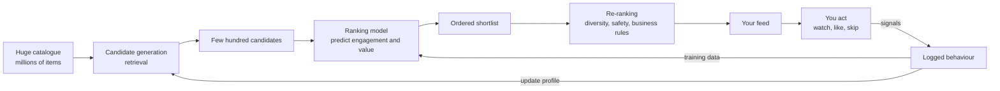
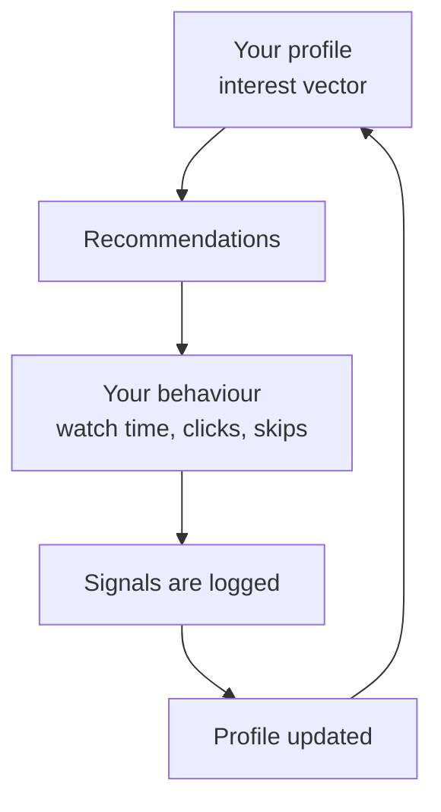
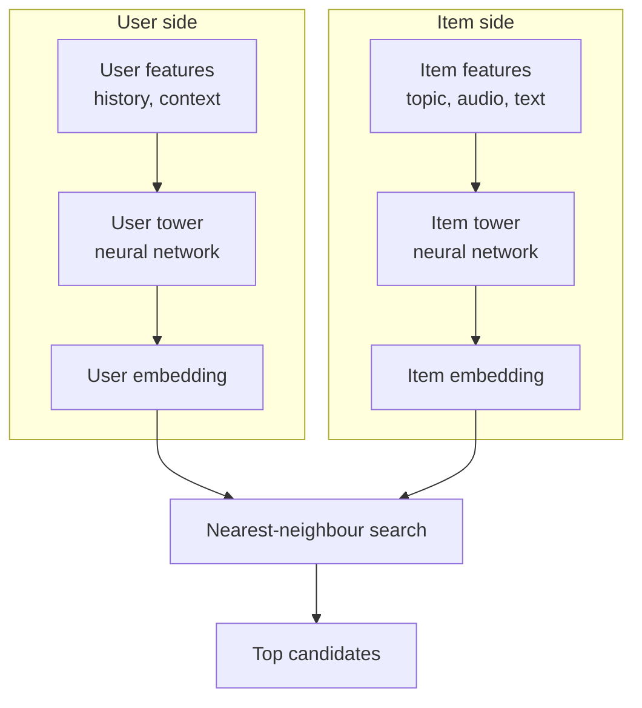
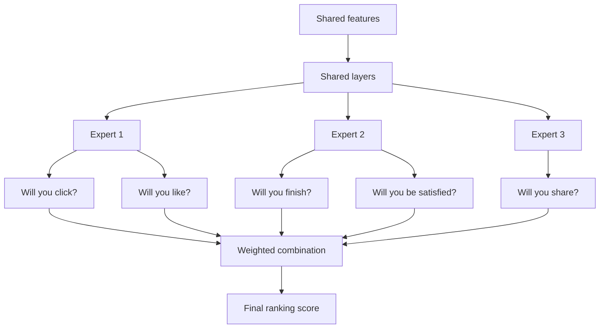
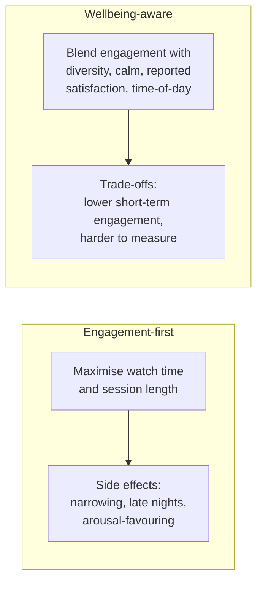
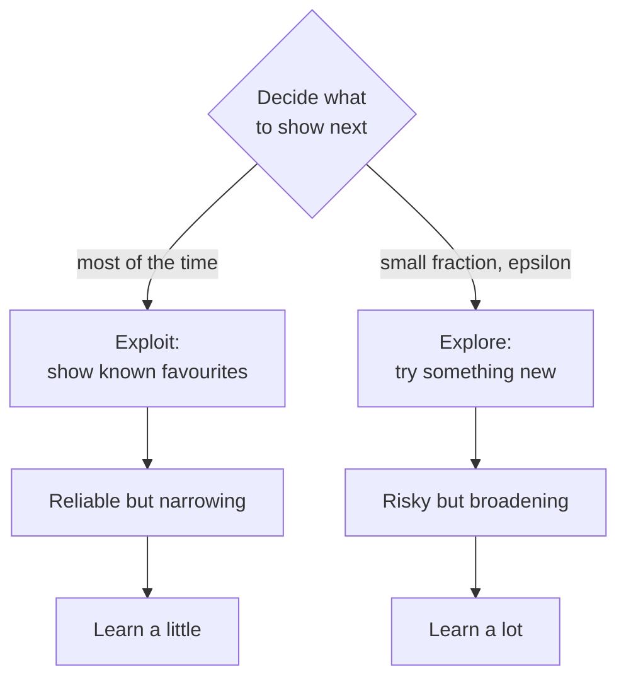

# Diagrams

Architecture diagrams for recommendation systems, written in [Mermaid](https://mermaid.js.org/) so they render directly on GitHub. Each diagram has a plain-language caption underneath.

These are simplified teaching diagrams. Real production systems have many more stages, caches, and safety filters. See [Part 2](../docs/part-02-platform-analysis) for the fact-versus-inference detail per platform.

---

## 1. The two-stage recommender: the shape of almost every feed

**Caption.** Out of millions of items the system first retrieves a shortlist that might suit you (candidate generation), then puts that shortlist in order (ranking), then adjusts for diversity and safety (re-ranking). What you do next becomes the training data that shapes tomorrow's feed. That last arrow is the feedback loop, and it is the heart of personalisation.

---

## 2. The feedback loop, drawn as a cycle

**Caption.** A loop with four steps: the system guesses your taste, shows you things, watches what you do, updates its guess. Run this loop thousands of times and the feed becomes startlingly personal. If exploration is low, the loop can also narrow your world. See the echo chamber simulation in Part 8.

---

## 3. Candidate generation: the two-tower retrieval model

**Caption.** A common way to shortlist from millions of items quickly. One network turns the user into a short list of numbers (an embedding), another turns each item into the same kind of numbers, and the system finds the items whose numbers sit closest to the user's. This is fast because item embeddings can be computed in advance. [INFERENCE] Most large platforms use a retrieval design in this family.

---

## 4. Multi-task ranking: predicting many things at once

**Caption.** Modern ranking models predict several outcomes at once: click, completion, like, share, satisfaction. Each prediction is multiplied by a weight and added up into one score. The choice of weights is a values choice in disguise: weight watch time heavily and you get one kind of feed, weight reported satisfaction heavily and you get another. This is the design space Parts 6 and 7 explore. Based on YouTube's published MMoE system (Zhao et al. 2019).

---

## 5. Engagement objective versus a wellbeing objective

**Caption.** Two different definitions of success produce two different feeds. Neither is free. An engagement-first objective is easy to measure but has side effects. A wellbeing-aware objective is kinder in intent but harder to measure and usually costs short-term engagement, which is why it is commercially difficult. Part 7 weighs this honestly.

---

## 6. Exploration versus exploitation

**Caption.** Every recommender faces this choice on every slot: give you more of what it knows you like (exploit) or take a chance on something new to learn more (explore). Too little exploration and your feed shrinks to a bubble. Too much and it feels random. The balance is a dial, and Part 5's code lets you turn it.

---

*To edit these, change the Mermaid code blocks above. GitHub renders them automatically. For slides or print, paste a block into the [Mermaid Live Editor](https://mermaid.live).*
